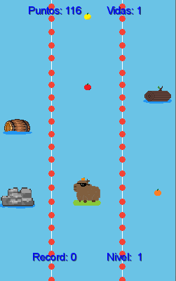
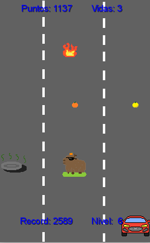
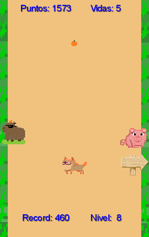
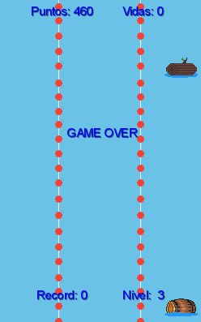

# Las CarpiAventuras de capy

## Equipo de desarrollo

- Mariel Kovinchich
- Matias F. Mattioli

## Capturas
(agregar)

    
 

## Reglas de Juego / Instrucciones

Wollok game similar a subway surfers en el que sos un carpincho llamado capy y tenes que viajar por varios lugares atrapando naranjas y otras frutas para saciar el hambre de capy y sumar puntos! ¡Pero cuidado! Ademas hay que esquivar a los obstaculos para evitar chocar y poder seguir jugando y alimentando a capy.

Teclas Importantes:   
- Flecha de teclado arriba => Mover hacia arriba  
- Flecha de teclado derecha => Mover hacia la derecha  
- Flecha de teclado izquierda => Mover hacia la izquierda  
- Flecha de teclado abajo => Mover hacia abajo  
- Barra espaciadora => Reiniciar nivel  

Poderes de las frutitas (ademas de ser comida de capy):  
- Naranja = 10 puntos  
- Limon = 100 puntos  
- Tomate = 1 vida extra  
- Arcoiris = Poder aleatorio de las otras frutas  

## Otros

- Algoritmos1/Unsam
- Versión de wollok 3.0
- Una vez terminado, no tenemos problemas en que el repositorio sea público
